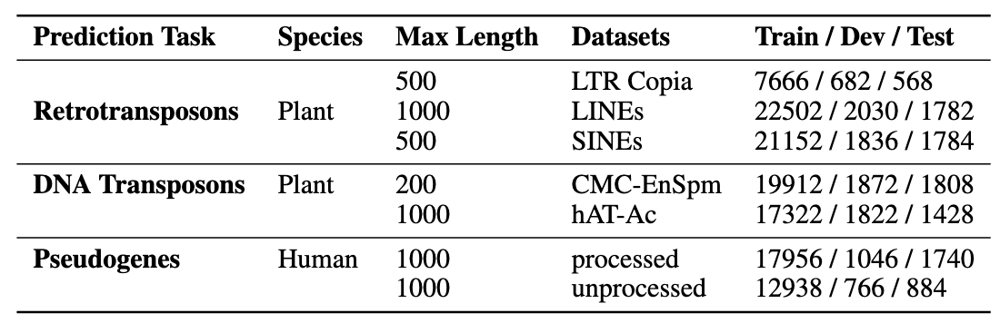

# Hyperbolic Genome Embeddings

Supplementary code for the paper Hyperbolic Genome Embeddings. The hyperbolic models used in this paper rely on the library of network components for HNNs in the Lorentz model detailed in the [HyperbolicCV](https://github.com/kschwethelm/HyperbolicCV) repository.   

## Installation

### Requirements

- Python>=3.8

```
conda create -n HGE python=3.8
```

- The repo is developed with Pytorch 1.13, using cuda 11.7

```
conda install pytorch==1.13.0 torchvision==0.14.0 torchaudio==0.13.0 pytorch-cuda=11.7 -c pytorch -c nvidia
```

- install requirements:

```
pip install -r requirements.txt
```


### Training

- For **classification**, choose a [config file](code/classification/config) and adapt the following command.

   ```bash
   python train.py -c configs/HCNN_SingleK_TEB.txt
   ```

   You can also add additional arguments without changing the config file. For example:

   ```bash
   python train.py -c configs/HCNN_SingleK_TEB.txt\
      --output_dir classification/output --device cuda:1 --dataset dna_cmc --length 200
   ```


## Transposable Elements Benchmark (TEB)

Download the TEB datasets from [here](https://drive.google.com/drive/folders/1P1FSoHGXRj-ub9D1O0uyUXp5iXp7PAAA?usp=sharing). Please see the HEB paper for details on dataset construction. Summary statistics for TEB:
<p align="center">

</p>


